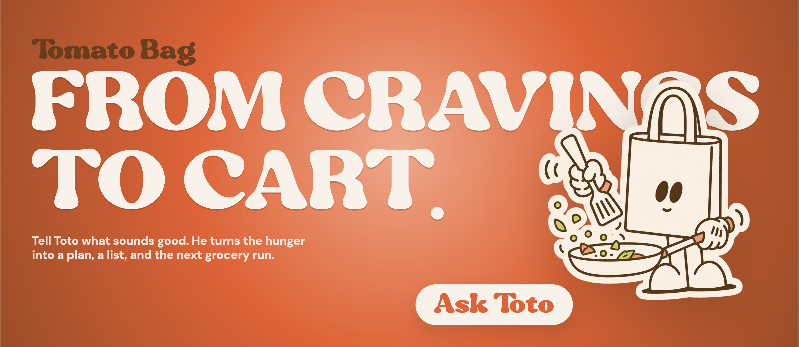

# Boppai (Hackathon Winner: Best Agentic User Experience)

## 🏆 [Award announcement by Prava Payments on X](https://x.com/pravapayments/status/2086103921765048605?s=20)



An AI agent for meal planning and ordering groceries.

## Full Demo Video

Check it out - [Boppai demo](https://www.youtube.com/watch?v=cx07-cYtqLg)

## The Problem Boppai Solves

People want to eat healthier, but planning meals, checking nutrition, and buying
the right groceries every week takes time and effort.

Boppai turns that work into a conversation. It helps the user move from food
goals and preferences to meal ideas, grocery baskets, and checkout preparation.

As grocery delivery and AI assistants become more common, Boppai explores how
healthy grocery shopping can become simpler, more personal, and less repetitive.

## Features

**Personalized food planning**: recommends meals using user preferences, diet
goals, allergies, budget, cravings, and long-term habits.

**Meal recommendations**: suggests dishes and weekly meal ideas based on what
the user wants to eat and the kind of routine they want to follow.

**Diet recommendations**: helps users make healthier choices by adapting meal
ideas around nutrition goals and dietary restrictions.

**Meal calendar creation**: turns recommendations into a planned meal calendar
so users can organize what to eat across the week.

**Dish-to-ingredients conversion**: breaks any dish or meal plan into the
ingredients needed to cook it.

**Calendar-to-grocery basket**: converts the planned meals into a grocery basket
with the ingredients needed for the week.

**Conversational shopping**: users chat naturally about goals, cravings,
recipes, or constraints instead of using forms, filters, and multiple apps.

**Swiggy and Zepto ordering**: prepares grocery ordering flows through Swiggy
Instamart and Zepto.

**Basket-first checkout**: grocery items are staged for review before moving
toward the real cart, keeping the user in control.

**Prava payments**: supports payment approval and checkout handoff using Prava
payments.

## How To Run The Project

The backend is Python + FastAPI. It needs Python 3.10+ and your own `claude` or `codex`
CLI already installed and signed in — Boppai never calls an AI API with a key, it
spawns the CLI you already have.

Backend (first run):

```bash
cd backend
python -m venv .venv
.venv/Scripts/pip install -r requirements.txt
```

On macOS/Linux use `.venv/bin/pip` instead.

Backend (every run):

```bash
cd backend
.venv/Scripts/python -m uvicorn app.main:app --port 8787
```

Frontend:

```bash
cd frontend
npm install
npm run dev
```

Open `http://localhost:5173`.

Optional configuration lives in `backend/.env` — copy `backend/.env.example`. Everything
except payments works without it.

### Grocery service (one-time login)

Boppai talks to Swiggy Instamart / Zepto over their **streamable HTTP MCP** endpoints, and
your agent CLI owns the OAuth. Two commands, once:

```bash
claude mcp add --transport http --scope user swiggy-instamart https://mcp.swiggy.com/im
claude mcp login swiggy-instamart
```

Swap `claude` for `codex` if that's your driver agent, and `swiggy-instamart` /
`https://mcp.swiggy.com/im` for `zepto` / `https://mcp.zepto.co.in/mcp` as needed.

`--scope user` is **required**, not a preference. Boppai spawns the CLI with the session
folder as its working directory, which the CLI treats as a different project — so a
project-scoped login is invisible at chat time and turns fail with
*"OAuth session expired and could not be refreshed"*.

> The older `npx -y mcp-remote <url>` bridge no longer works for these services. Every
> published `mcp-remote` from 0.11.0 onward enforces RFC 8414 §3.3, and Swiggy's
> authorization-server metadata declares `issuer: https://mcp.swiggy.com/auth` while being
> served at a path implying `https://mcp.swiggy.com/`. The CLIs' own OAuth clients accept
> it, so Boppai hands them the URL directly and skips the bridge.

### Payments

Boppai supports two payment rails, switchable at `PUT /api/settings/payment-provider`:

- **Prava** *(default)* — the original hackathon integration that won Best Agentic User
  Experience. It mints a one-time card credential and hands it to browser automation for
  the merchant form. It needs merchant credentials that are no longer available, so it
  now serves mainly as the showcase of that flow.
- **Razorpay (test mode)** — the free rail. Put `rzp_test_*` keys in `backend/.env` and
  the agent can create a Payment Link, hand you the URL in chat, and poll until it's
  actually paid. No real money moves, and Boppai never touches card data — you pay on
  Razorpay's own hosted page.

Whichever rail is active, the agent must read the **live** cart and get an explicit
confirmation before starting a checkout, and it will never claim a payment succeeded
until the rail itself confirms it.

Browser automation (`BROWSERCLAW_MCP_URL`) is optional. When it isn't set, the agent is
told so explicitly and hands you the payment steps instead of pretending to click.

Tests:

```bash
cd backend
.venv/Scripts/python -m pytest
```

> The original Node/Express backend is kept for reference at `backend-node-legacy/`.
> See [MIGRATION.md](MIGRATION.md) for what changed and why.
